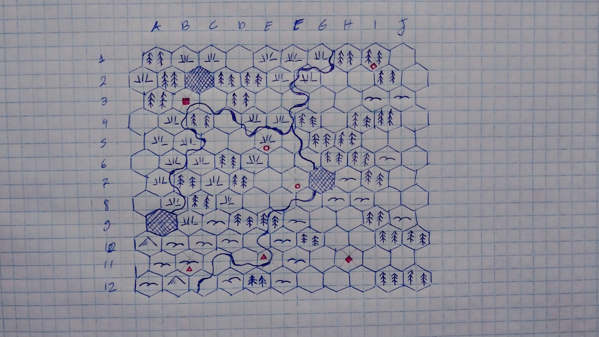

## Como assim?

No decorrer dos anos em contato com RPG de mesa, passei mais tempo lendo do que jogando. A ideia de jogar sozinho aparece de vez em quando, mas é difícil acreditar que a gente não pareça estranho fazendo isso.

Bom, eu fiz isso, pelo menos tentei bastante, e cheguei a dizer que isso não era pra mim. Não sentia uma conexão com as aventuras, preparar o jogo levava mais tempo que jogar e no fim parecia perda de tempo.

## Por que jogar solo agora?

Embora a maioria dos jogadores solitários costumem jogar e desenvolver seu personagem, minha bagagem de mestre pesa muito mais para o desenrolar do cenário e não apenas do ponto de vista de um ou outro personagem. Jogar solo para mim é uma ferramenta de criação e testes, em que sou um arquiteto, mas também observador dos eventos inusitados que ocorrem com a ajuda dos dados, muito parecido com narrar uma sessão para outras pessoas.

## ODND

*Original Dungeons & Dragons*. Esse jogo de 1974 possui uma ênfase na exploração do mundo e de seus labirintos subterrâneos, além de ter raízes nos Wargames, por meio de seu antecessor *Chainmail*. Contudo, estarei utilizando uma releitura da caixa original, chamada *Seven Voyages of Zylathen*, que mantém a simplicidade e elegância das regras originais, além de beber de várias fontes, como Rei Arthur, Terra-média, Noites Arábicas, fantasia pulp e ficção científica.

## Vamos precisar de um mapa

Não é a primeira coisa que se pensa ao começar um jogo solo, que geralmente começa com os personagens, mas como meu foco é manter o chapéu de mestre, mesmo sozinho, comecemos por ele.

Mapas geralmente demandam tempo e quando uma etapa começa a tomar tempo demais, posso acabar perdendo o interesse, então a verossimilhança será deixada um pouco de lado em favor de uma maior fluidez.

Como guia, utilizei os procedimentos do blog *The Welsh Piper*, *[Hex-based Campaign Design](https://welshpiper.com/hex-based-campaign-design-part-1/)*, agrupando hexágonos ao redor terrenos principais. Adicionei alguns rios e obtive o seguinte resultado:

Os pontos em vermelho são os principais pontos habitados, gerados por uma rolagem de 1 em 1d20. Escolhi o ponto mais privilegiado para ser uma cidade e sorteei os outros com base no livro 4: *The Campaign* de Zylarthen. Como cada hexágono representa 15 milhas, há espaço para assentamentos menores dentro de cada hexágono já ocupado.

* △ São torres de arcanistas
* ◆ São Cidades
* ◇ São vilarejos
* ○ São Templos
* ■ São cidades

Agora só falta um nome para a região. Escolhi Vanion, derivado de Rhovanion, terra dos cavaleiros de Rohan, por quem sempre tive admiração. Talvez tenhamos muitos cavalos!

Na próxima postagem conheceremos as pobres almas que explorarão essa terra. Fight on!